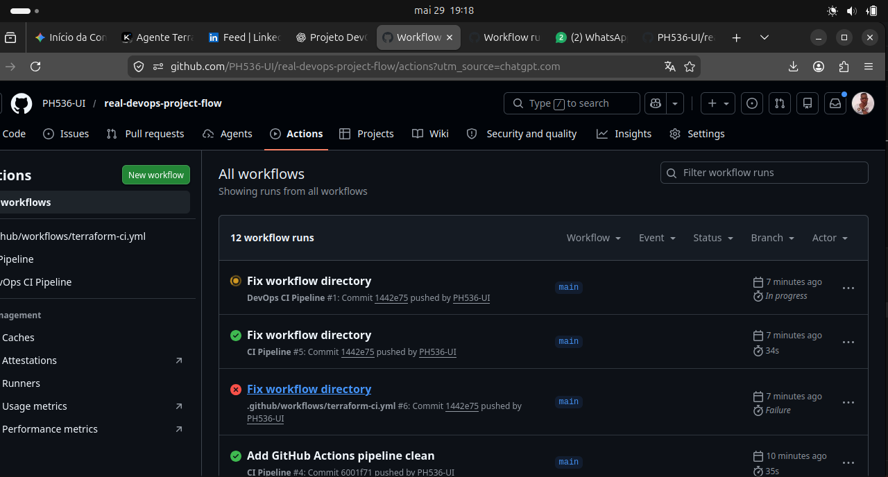
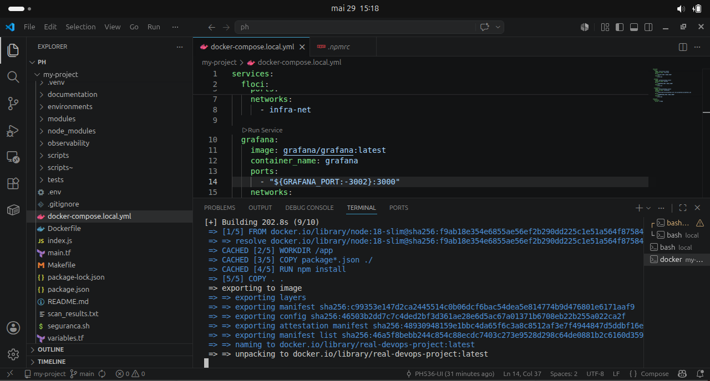
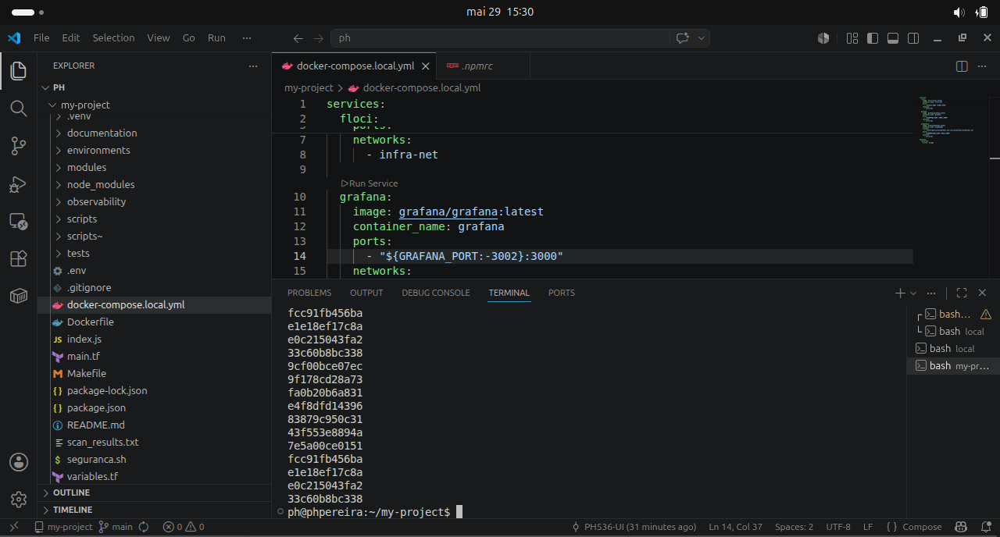
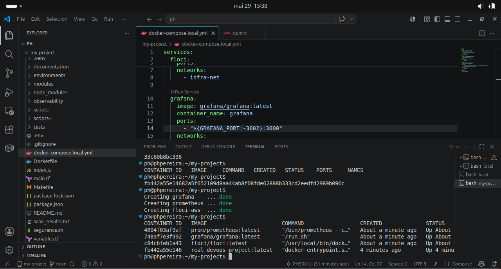

# Kubernetes Observability Stack

Projeto de observabilidade executado localmente utilizando Kubernetes (Kind).

## Stack

- Kubernetes (Kind)
- Grafana
- Prometheus
- Loki
- Promtail
- Node Exporter

## Arquitetura

Logs:
Host -> Promtail -> Loki -> Grafana

Métricas:
Node Exporter -> Prometheus -> Grafana

## Tecnologias

- Docker
- Kubernetes
- PromQL
- LogQL
- Linux
- YAML

## Evidências

### Pods



### Prometheus Targets



### Loki Logs



### Grafana Dashboard



## Como executar

```bash
kubectl apply -f kubernetes/
```

## Aprendizados

- Troubleshooting Kubernetes
- Observabilidade moderna
- Monitoramento com Prometheus
- Centralização de logs com Loki
- Dashboards Grafana
